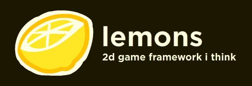

lemons is a game framework that's built on haxe that provides.. well what a game framework should, a framework to build your games on

# installing

there isnt a haxelib version avalible yet so you'll have to follow the installing from github instructions

## installing from github
go to your bash shell of choice or command prompt and run

```
cd <whereever you want to install lemons in>
git clone --recurse-submodules https://github.com/LemonsFramework/lemons.git
cd lemons
haxelib dev .
```
since `haxelib git` doesent recursivley clone submodules, you have to use this janky fix

you will need to follow the building instructions at the bottom if you're installing it from github

# building

again, go to your bash shell of choice or command prompt and run `haxelib run lemons rebuild`. oh, and you'll have to have cmake installed.	